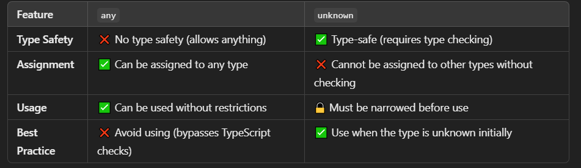

# TypeScript

## Languages that Use TypeScript

- Angular
- Vue
- Next.js

## Introduction to TypeScript

- TypeScript (TS) is a superset of JavaScript (JS).
- All valid JS code is also valid TS code.
- TS catches errors at compile time instead of runtime (unlike JS).
- Browsers can't understand TS, so we need to compile it into JS.
- TS supports static typing.

## TS Configuration File

Initialize a TypeScript configuration file with:

```sh
tsc --init
```

## Data Types in TypeScript


### Primitive Data Types

- `number`: Integer, floating-point numbers.
- `boolean`: `true` or `false`.
- `string`: Text values.
- `bigint`: Used for very large numbers (beyond `9007199254740991`). JavaScript may lose precision for numbers beyond this range, and `bigint` ensures accurate large-number calculations.
- `any`: Disables type checking, making code feel like JS.
- `unknown`: Safer than `any`, enforcing type checking.

```ts
let myName: any = 'John Doe';
myName = 12;
myName = false;
```

### Difference Between `any` and `unknown`


[Example Explanation](./src/4-any_unknown.ts)

## TypeScript Terminologies

### Type Annotation

Explicitly specifying the type of variables/functions:

```ts
let num1: number;
```

### Type Inference

TypeScript automatically determines the type based on the assigned value:

```ts
let name = 'John';
name = 10; // Error: Type 'number' is not assignable to type 'string'
```

## Iteration Methods in Arrays

[Comparison of `forEach`, `for` Loop & `for...of`](./src/9-different-for-loop.md)

## Map, Filter, and Reduce

[Comparison of `map()`, `filter()`, and `reduce()`](./src/10-map-filter-reduce.md)

## Type Alias

Instead of defining a type for each object, we can create a reusable type alias:

```ts
type User = {
  name: string;
  age: number;
  isAdmin?: boolean; // Optional property
};
```

## Call Signature

Defines the structure of a function, including its name, parameters, and return type:

```ts
type Greet = (name: string) => string;
```

## Enums

Used for defining a set of named constants:

```ts
enum Status {
  Pending,
  Shipped,
  Delivered,
}

let orderStatus: Status = Status.Shipped;
```

### When to Use Enums

- When you have a fixed set of related constants (e.g., days of the week, status codes).
- To improve code readability by using meaningful names instead of magic numbers/strings.
- When autocomplete and type safety are required.

### `const enum` for Optimization

To avoid unnecessary JavaScript output, prefer `const enum` when possible:

```ts
const enum Status {
  Pending,
  Shipped,
  Delivered
}
```

## Tuples

A tuple is a fixed-size collection of elements where each element can have a different type:

```ts
let person: [string, number] = ['Alice', 30];
```

### Tuple vs Array

- **Array**: All elements have the same type.

```ts
let numbers: number[] = [1, 2, 3];
```

- **Tuple**: Elements can have different types, and order matters.

```ts
let data: [string, number] = ['Alice', 30];
```

### Key Features of Tuples

1. **Fixed Length (but `push()` is allowed)**

   ```ts
   let point: [number, number] = [10, 20];
   point.push(30); // Allowed, but accessing point[2] will cause an error
   ```

2. **Type Order Matters**

   ```ts
   let data: [string, number] = ['Alice', 30];
   data = [30, 'Alice']; // Error
   ```

3. **Optional Elements**

   ```ts
   let optionalTuple: [string, number?] = ['Alice'];
   ```

4. **Rest Elements**

   ```ts
   let rgb: [number, number, number, ...number[]] = [255, 0, 0, 128, 64];
   ```

### When to Use Tuples

- Fixed-size data (e.g., coordinates `[x, y]`, RGB colors `[r, g, b]`).
- Returning multiple values from a function.
- Enforcing strict type and order constraints.

### Example: Tuple vs Object

**Tuple:**

```ts
let user: [string, number] = ['Alice', 30];
console.log(user[0]); // "Alice"
console.log(user[1]); // 30
```

**Object:**

```ts
let user = { name: 'Alice', age: 30 };
console.log(user.name); // "Alice"
console.log(user.age); // 30
```

### Tuple Behavior in TypeScript vs JavaScript

| Action               | TypeScript Compile-Time | JavaScript Runtime |
|----------------------|-----------------------|---------------------|
| `push()`            | ✅ Allowed (no error)  | ✅ Works            |
| Access `[2]`        | ❌ Error               | ✅ Works            |
| Declare `[number, number]` | ✅ Fixed-length type | ❌ Dynamic array |

## Union Types (`|`)

A union type allows a variable to hold multiple types:

```ts
let variable: string | number;
```

### When to Use Union Types

- When a value can be one of several types.
- Example: A function that accepts both string and number inputs.

## Intersection Types (`&`)

An intersection type combines multiple types into one:

```ts
type Employee = { id: number };
type User = { name: string };

let person: Employee & User = { id: 1, name: 'Alice' };
```

### Important Note on Intersection Types

Intersection types **merge properties**, meaning all properties from both types must be present.

```ts
// Valid
let person: Employee & User = { id: 1, name: "Alice" };

// Error: Property 'name' is missing
let employee: Employee & User = { id: 1 }; // ❌ TypeScript error
```
